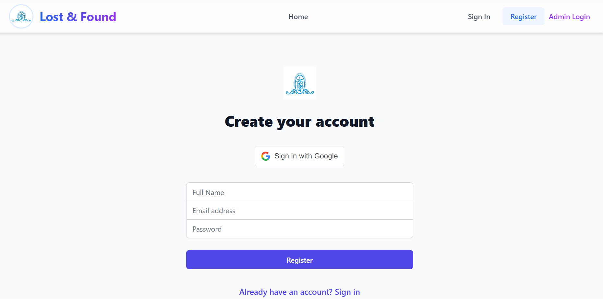
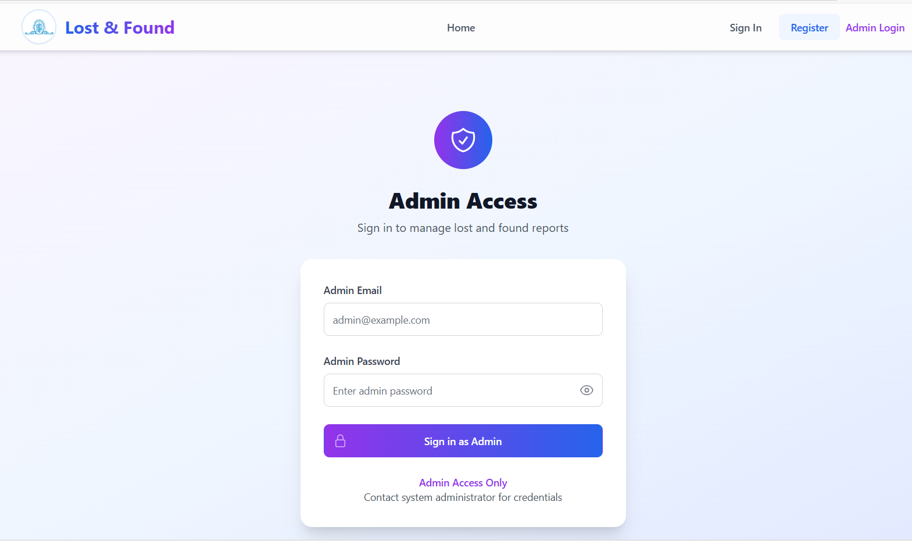
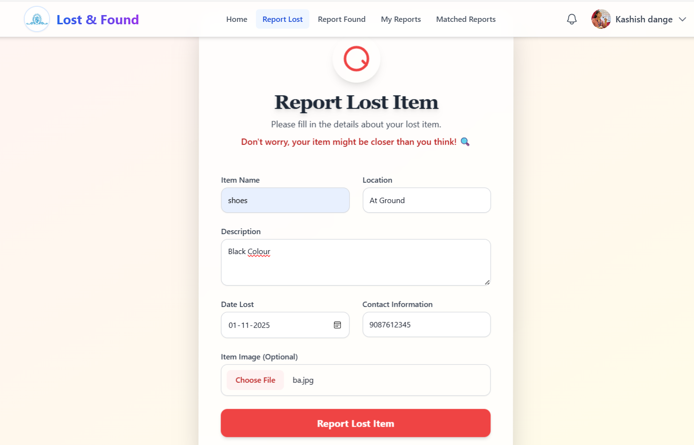
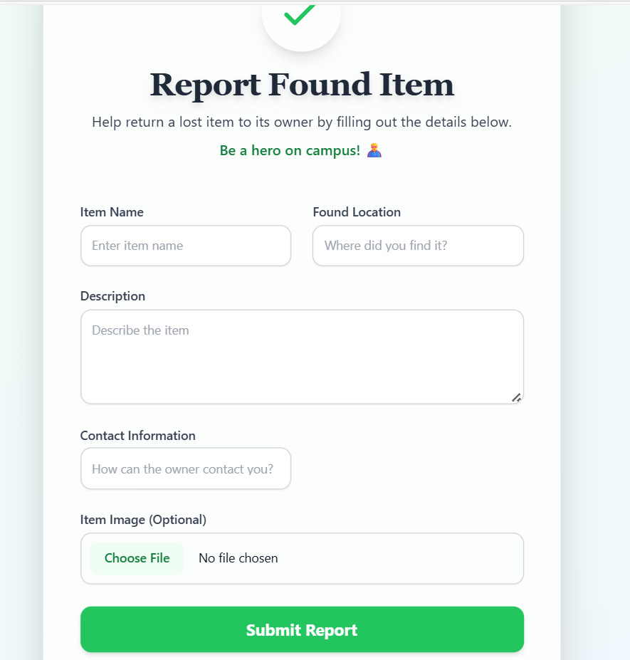
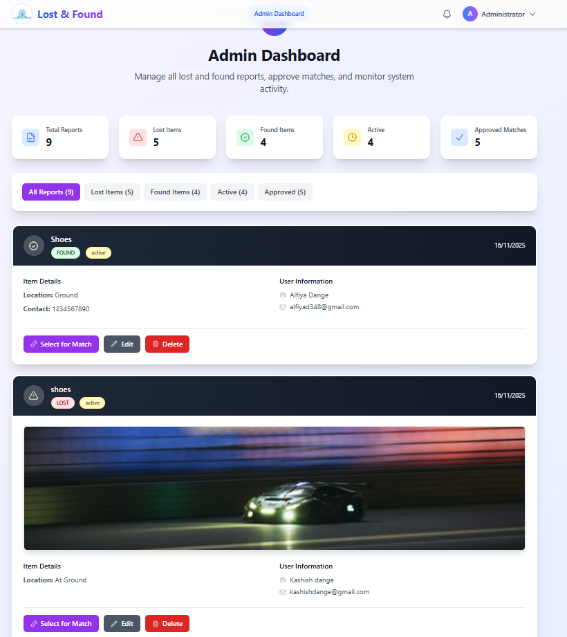
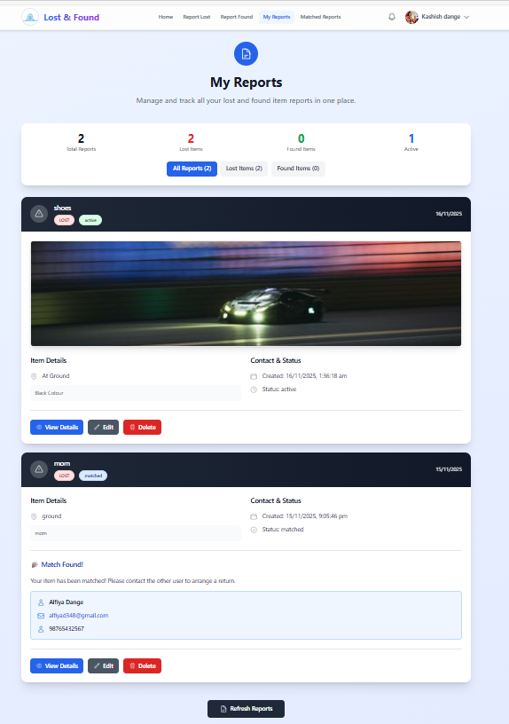
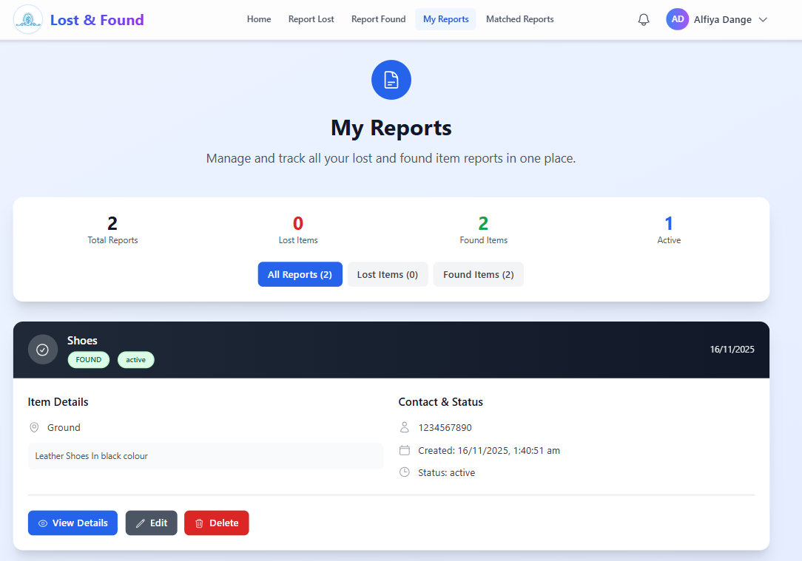
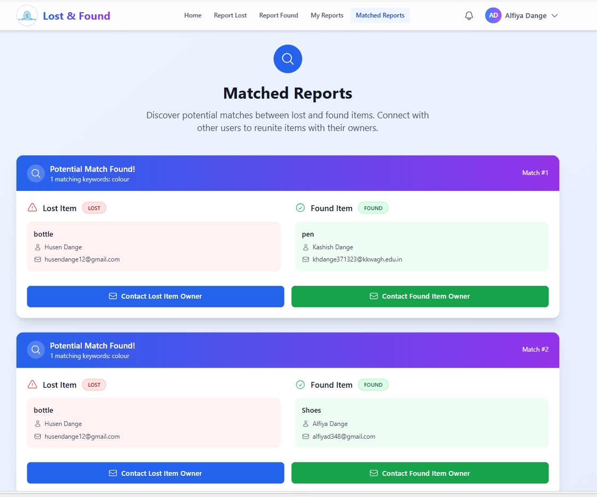
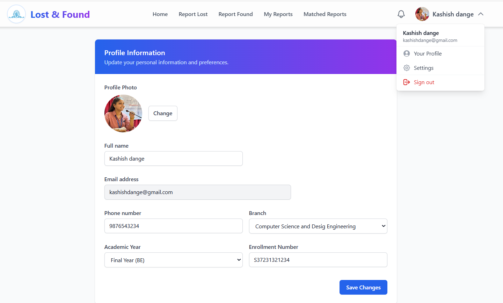
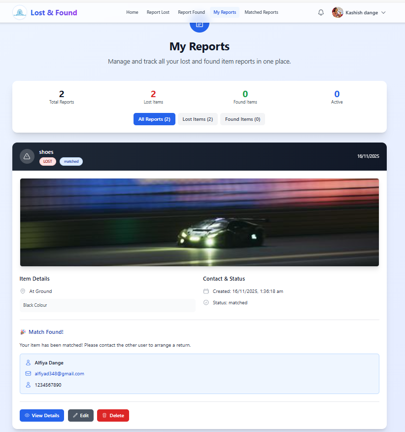

# Lost & Found App

## 🚀 About This Project

This full-stack application helps manage lost and found items for kkwagh college, connecting users who have lost an item with those who have found one.

## ✨ Features

* **Secure User Authentication:** Users can sign up, log in and manage their accounts. Includes Google OAuth for quick access.
* **Role-Based Access:** Separate access and dashboards for regular users and administrators.
* **Comprehensive Reporting:** Easy-to-use forms for reporting both **lost** and **found** items, including details like location, description, and image uploads.
* **User Dashboard ("My Reports"):** A personal dashboard for users to track, manage, edit and delete their own reports.
* **Admin Dashboard:** A powerful dashboard for admins to oversee all reports, manage system activity, and approve item matches.
* **Smart Matching System:** Automatically suggests potential matches between lost and found items.
* **Match Management:** Users can view matched items and contact the other party to arrange a return. Admins can review and approve matches.
* **Responsive Design:** A clean and modern UI that works seamlessly on both desktop and mobile devices.

## 📸 Screenshots

| | | |
| :---: | :---: | :---: |
| **Home Page** | **Register Page** | **Admin Login** |
|  |  |  |
| **Report Lost Item** | **Report Found Item** | **Admin Dashboard** |
|  |  |  |
| **My Reports (Matched)** | **My Reports (Active)** | **Admins Approvals** |
|  |  |  |
**Profile** | **Matched reports** |
|  |  |

## Tech Stack

* **Frontend**: React.js
* **Backend**: Node.js with Express
* **Database**: MongoDB
* **Authentication**: JWT

## Getting Started

### Prerequisites

* **Node.js**: v14 or higher
* **npm** or **yarn** package manager
* **MongoDB**: A MongoDB connection string (e.g., from [MongoDB Atlas](https://www.mongodb.com/cloud/atlas))
* **Google Cloud Account**: To set up Google OAuth 2.0 credentials
* **Cloudinary Account**: For image and media storage

### Installation

1.  **Clone the repository**
    ```bash
    git clone [https://github.com/your-username/your-repository-name.git](https://github.com/your-username/your-repository-name.git)
    ```
    *(Remember to replace the URL with your actual repository link)*

2.  **Install Server Dependencies**
    (Navigate into the `server` folder)
    ```bash
    cd server
    npm install
    ```

3.  **Install Client Dependencies**
    (From the root folder, navigate into the `client` folder)
    ```bash
    cd ../client
    npm install
    ```

4.  **Set Up Server Environment Variables**
    In the `server` directory, create a new file named `.env`. Copy and paste the following, replacing the placeholder values with your own credentials.

    ```
    # ========================
    # Server Configuration
    # ========================
    PORT=5000
    NODE_ENV=development
    HOST=localhost

    # ========================
    # Database Configuration
    # ========================
    # Your MongoDB database connection string (e.g., from MongoDB Atlas)
    MONGODB_URI=your_mongodb_connection_string

    # ========================
    # JWT Configuration
    # ========================
    # A long, random, and secret string for signing JWT tokens
    JWT_SECRET=your_super_secret_jwt_key
    JWT_EXPIRES_IN=24h

    # ========================
    # Session Configuration
    # ========================
    SESSION_SECRET=your_session_secret_here
    COOKIE_MAX_AGE=86400000

    # ========================
    # Google OAuth Configuration
    # ========================
    GOOGLE_CLIENT_ID=your_google_client_id
    GOOGLE_CLIENT_SECRET=your_google_client_secret
    GOOGLE_CALLBACK_URL=http://localhost:5000/api/auth/google/callback

    # ========================
    # Email Configuration
    # ========================
    # (e.g., using an app-specific password for Gmail)
    EMAIL_USER=your-email@gmail.com
    EMAIL_PASS=your-email-app-password

    # ========================
    # CORS Configuration
    # ========================
    # The URL of your React client
    CORS_ORIGIN=http://localhost:3000

    # ========================
    # Rate Limiting (Optional)
    # ========================
    RATE_LIMIT_WINDOW_MS=900000
    RATE_LIMIT_MAX=100
    ```

5.  **Set Up Client Environment Variables**
    In the `client` directory, create a new file named `.env` (or `.env.local`) and add your React-specific variables.

    ```
    # The Google Client ID (must start with REACT_APP_)
    REACT_APP_GOOGLE_CLIENT_ID=your_google_client_id
    ```

6.  **Run the Application**

    * **Start the server:**
        (In your terminal, from the `server` folder)
        ```bash
        npm start
        ```

    * **Start the client:**
        (Open a **new** terminal, from the `client` folder)
        ```bash
        npm start
        ```

## Contributing

1.  Fork the repository
2.  Create your feature branch
3.  Commit your changes
4.  Push to the branch
5.  Create a new Pull Request

## License

This project is licensed under the MIT License - see the [LICENSE](LICENSE) file for details.